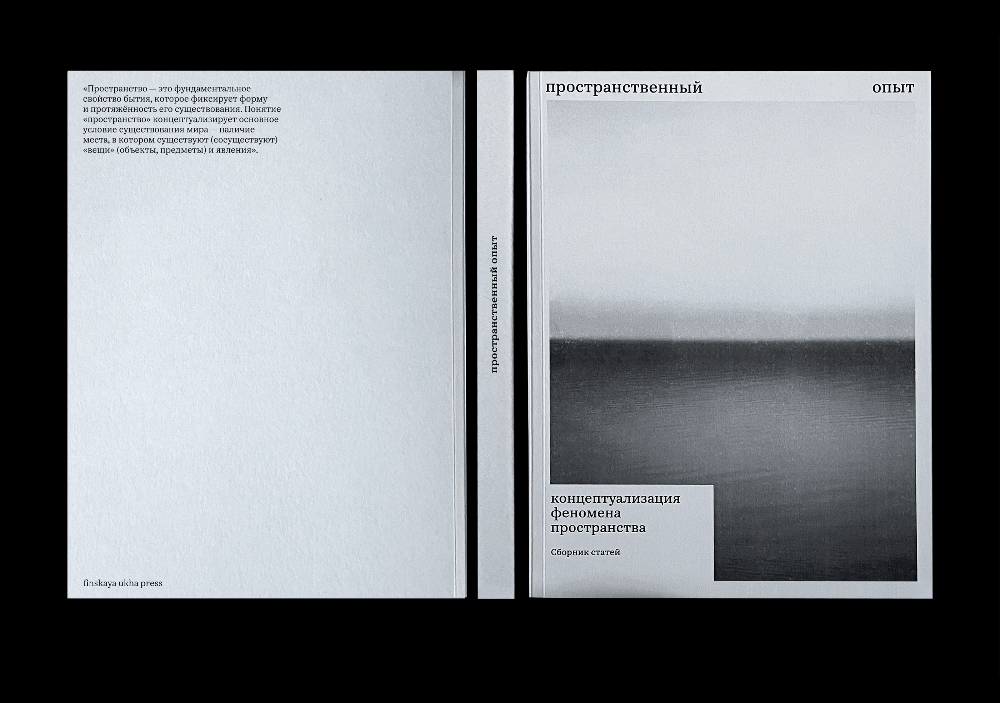

.png)

  𒊹 MULTI-CHANNEL MEDIA ABOUT EVERYDAY LIFE (NON)OBVIOUS

 

  VIEW PROJECT→

  𒊹 VISUAL RESEARCH. A NEW LOOK AT EVERYDAY OBJECTS

  The research is devoted to the analysis of methods of photographic observation of everyday objects and deautomatization of their perception.

  VIEW PROJECT→

  𒊹 SPATIAL EXPERIENCE. COLLECTION OF ARTICLES

  Spatial experience is the relationship of a person with a particular space that he builds during his life.

  VIEW PROJECT→

